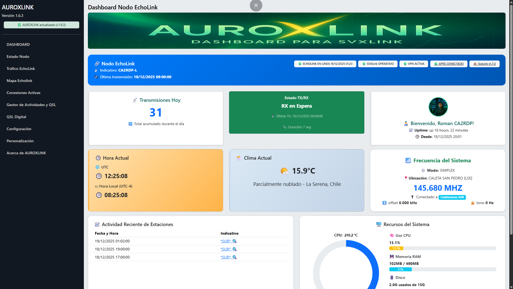

# 🌌 Auroxlink - Sistema de Control para SVXLink y EchoLink

**AuroxLink** es un sistema web avanzado para monitoreo, gestión y personalización de nodos SVXLink. Desarrollado desde cero por [CA2RDP - TELECOVIAJERO](https://youtube.com/@TelecoViajero), AuroxLink une tecnología, radioafición y pasion por el hobbie.

## DASHBOARD 


# Presentacion de Auroxlink

https://www.youtube.com/watch?v=Cia-4NrZDGo
[](https://youtu.be/Cia-4NrZDGo)

---

##

## 🚀 Características principales

- 📡 **Dashboard en tiempo real** con información de conexiones, estado del nodo, tráfico de voz y estadísticas.
- 🎚️ **Control de audio ALSA via web** (volumen, ganancia, niveles, sin necesidad de usar alsamixer).
- 🌐 **Configuración de red** (IP estática/dinámica, escaneo de WiFi y conexión directa desde el navegador).
- 📊 **Gráficos interactivos** de transmisiones por hora, duración y actividad diaria.
- ⚙️ **Editor web seguro** de los archivos `svxlink.conf` y `ModuleEchoLink.conf`.
- 🔁 **Control de servicios SVXLink**: iniciar, detener o reiniciar desde el navegador.
- 🔔 **Alertas por Telegram** al detectar conexiones o desconexiones de estaciones/nodos (opcional).
- 🖼️ **Personalización visual**: cambia banners, colores y branding desde la interfaz.
- 🔒 **Protección por contraseña** en secciones sensibles (configuración y control).
- 🧪 **Módulo de pruebas y monitoreo** de logs en vivo.
- 📱 **Modo escritorio y móvil** con diseño responsive adaptable.

---

## 📁 Estructura del Proyecto

```bash
├── index.php                # Dashboard principal
├── configuracion.php        # Configuración ModuleEchoLink
├── estado-nodo.php          # Estado del nodo y conexión actual
├── trafico-echolink.php     # Estadísticas de uso y tráfico
├── control_audio.php        # Control de niveles ALSA
├── red.php                  # Configuración IP y redes WiFi
├── personalizacion.php      # Editor visual de AuroraLink
├── telegram_alert.php       # Envío de alertas por Telegram
├── includes/                # Funciones auxiliares y datos compartidos
├── guardar_*.php            # Archivos de backend para guardar configuración
├── style/                   # CSS personalizado
└── logs/                    # Logs del sistema (opcional, ignorado en Git)

```

👉 [Ver INSTALL.md](INSTALL.md) 

- Opcional: bot de Telegram y clave de bot

## 📦 Versión actual
- v1.5 – Primera versión estable de AuroxLink
- Ver Release Actual → [AUROXLINK v1.6.3](https://github.com/telecov/auroxlink/releases/tag/v1.6.3)

## 📝 Log

👉 [Ver cambios recientes](CHANGELOG.md)


## Agradecimientos especiales:
– Auditoría de seguridad y desarrollo.
- 🔐 [Esteban - CA3EUO](https://www.qrz.com/db/CA3EUO)

## 🧑‍💻 Autor

CA2RDP - TelecoViajero
Radioaficionado, desarrollador autodidacta y creador de contenidos digitales:

# 🌐 GitHub: https://github.com/telecov
# 🌐 QRZ: https://www.qrz.com/db/CA2RDP
# 🔗 TikTok: https://tiktok.com/@telecoviajero
# 🔗 Instagram: https://instagram.com/telecoviajero
# 📺 YouTube: https://www.youtube.com/@Telecoviajero


## Puedes Apoyar este proyecto de manera voluntaria
 
 https://www.paypal.com/donate/?hosted_button_id=SRA7QC84FAV3A
