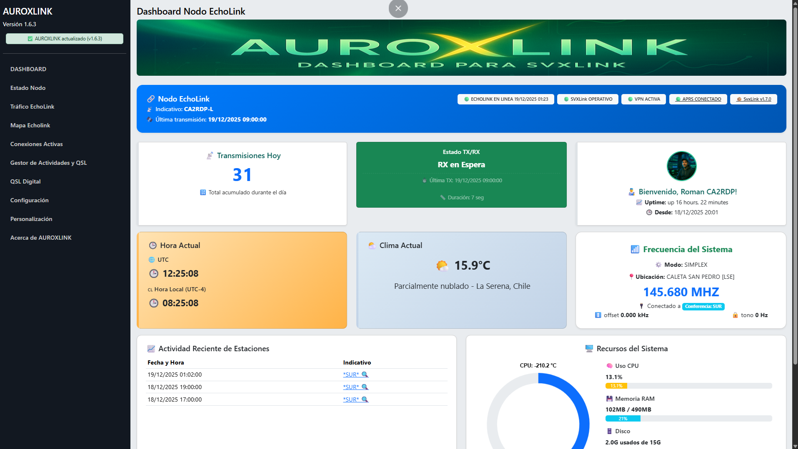

# 🌌 AuroxLink – Web Control System for SVXLink & EchoLink

🇪🇸 [Español](README.md)| 🇺🇸 English

  

  <b>Advanced monitoring and control for SVXLink nodes</b> 
  Built with passion for amateur radio 📡

---

## 🎥 Project Overview

  
   
  <b>▶️ Watch AuroxLink presentation on YouTube</b>

---

## 🚀 What is AuroxLink?

**AuroxLink** is a powerful web-based system designed to **monitor, control, and manage SVXLink and EchoLink nodes** through a modern and intuitive interface.

No more dependency on Linux terminal — everything is accessible from your browser.

---

## ✨ Key Features

### 📡 Real-time monitoring
- Node status
- Active connections
- Live voice traffic
- System statistics

### 🎚️ Audio control (ALSA)
- Volume adjustment
- Input/output gain control
- No need for `alsamixer`

### 🌐 Network configuration
- Static / Dynamic IP
- WiFi scanning
- Direct connection from the web interface

### 📊 Statistics & graphs
- Activity per hour
- Transmission duration
- Daily usage insights

### ⚙️ Advanced management
- Secure editor for:
  - `svxlink.conf`
  - `ModuleEchoLink.conf`
- Service control:
  - ▶️ Start
  - ⏹️ Stop
  - 🔄 Restart SVXLink

### 🔔 Integrations
- Telegram alerts (optional)
- Connection/disconnection notifications

### 🎨 Customization
- Change banners and branding
- UI color customization
- Fully responsive design

### 🔒 Security
- Password-protected sections
- Configuration access control

### 🧪 Extra tools
- Live logs monitoring
- Testing module

---

## 📦 Installation

👉 [Full installation guide](INSTALL.md)

**Optional:**
- Telegram bot integration

---

## 🆕 Current Version

- **Stable version:** v1.5  
- **Latest release:**  
👉 https://github.com/telecov/auroxlink/releases/tag/v1.6.3

---

## 📝 Changelog

👉 [View changes](CHANGELOG.md)

---

## 🙌 Special Thanks

- 🔐 **Esteban - CA3EUO**  
  Security audit and development support  
  https://www.qrz.com/db/CA3EUO

---

## 🧑‍💻 Author

**CA2RDP – TelecoViajero**  
Ham Radio Operator | Developer | Content Creator

- 🌐 GitHub: https://github.com/telecov  
- 🌐 QRZ: https://www.qrz.com/db/CA2RDP  
- 📺 YouTube: https://www.youtube.com/@Telecoviajero  
- 📱 TikTok: https://tiktok.com/@telecoviajero  
- 📸 Instagram: https://instagram.com/telecoviajero  

---

## ❤️ Support the Project

  <b>If this project helped you, consider supporting it 🚀</b>  

  

    
  <i>Thank you for supporting tools for the radio community 📡</i>

---

## ⭐ Like the project?

Give it a ⭐ on GitHub and share it with the community!
