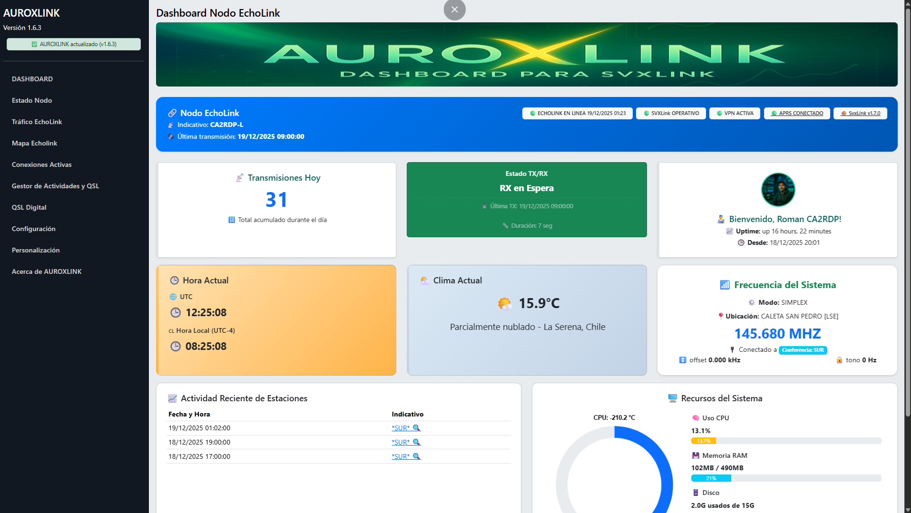

# 🌌 AUROXLINK — Web panel for SvxLink and EchoLink

🇪🇸 [Español](README.md) | 🇺🇸 English

<p align="center">
  
</p>

<p align="center">
  <b>Visual monitoring, configuration and control for SvxLink and EchoLink nodes.</b><br>
  Designed for amateur radio operators who want to manage their node from a clear and modern web interface. 📡
</p>

---

## 🚀 What is AUROXLINK?

**AUROXLINK** is a web interface for managing a node based on **SvxLink** and **EchoLink** from the browser, reducing the need to work directly from the Linux terminal for everyday tasks.

It provides node status, activity, service controls, main configuration editing, audio adjustment, network management and interface customization.

> **SvxLink is an independent project created and maintained by SM0SVX / Tobias Blomberg.** AUROXLINK does not replace or change its authorship; it provides a web management and automation layer around the official software.

- Official SvxLink project: https://github.com/sm0svx/svxlink
- SM0SVX: https://github.com/sm0svx

---

## ✨ Main features

- 📡 **Real-time dashboard** with node and connection status.
- 📊 **Activity and statistics** for transmissions and EchoLink traffic.
- 🎚️ **ALSA audio control from the web**.
- ⚙️ **Editing of `svxlink.conf` and `ModuleEchoLink.conf`**.
- ▶️ **SvxLink service control**: start, stop and restart.
- 🌐 **Network and WiFi configuration** from the interface.
- 🔐 **Protected access** for sensitive areas.
- 🔔 **Optional Telegram alerts and daily status**.
- 🖼️ **Visual customization** for banner, colors, node name and information.
- 🔒 **Tailscale** integration for secure remote access.
- 🧾 **Log monitoring** and system status.
- 💾 **Configuration backup and restore**.
- 📱 **Responsive design** for desktop, tablet and mobile.

---

## 📦 Quick installation

On a clean compatible Raspberry Pi OS or Debian installation:

```bash
curl -fsSL https://raw.githubusercontent.com/telecov/auroxlink/main/install_auroxlink.sh | sudo bash
```

The installer automatically prepares Apache, PHP, dependencies, `svxlink-server`, Tailscale, permissions, services and files required by AUROXLINK.

👉 [Full installation guide](INSTALL_EN.md)

---

## 📡 Optional SvxLink update

AUROXLINK includes a separate updater for installing the latest stable official SvxLink release published by SM0SVX.

Check first:

```bash
sudo bash /var/www/html/install_svxlink_latest.sh --check
```

To update:

```bash
sudo bash /var/www/html/install_svxlink_latest.sh
```

### ⚠️ Important

**Only update SvxLink after the base distribution version is fully configured and operational.**

Before updating, confirm:

```bash
sudo systemctl status svxlink --no-pager
```

The service must be working correctly with the node's real audio, RX/TX and configuration. The updater uses that working configuration as the reference when testing a new release before activation and provides automatic rollback if validation fails.

---

## 🌐 Access the panel

After installation:

```bash
hostname -I
```

Open in your browser:

```text
http://SERVER-IP/
```

Initial credential:

```text
Password: admin123
```

Change the password after the first login.

---

## 🛠️ Main components

```text
index.php                      Main dashboard
settings.php                   SvxLink / EchoLink / audio configuration
status-node.php                Server and SvxLink service status
connections.php                Active connections
activity_log.php               Activity log
qsl_generator.php              Activity and QSL management
custom.php                     Customization and network management
monitor_log_svx.php            SvxLink event monitor
install_auroxlink.sh           Main installer
install_svxlink_latest.sh      Optional SvxLink updater
update_auroxlink.sh            AUROXLINK updater
```

---

## 📦 Current version

**AUROXLINK v1.7**

The `main` branch may contain later improvements under preparation. Stable versions are identified using tags/releases.

👉 [View CHANGELOG.md](CHANGELOG.md)

---

## 🧑‍💻 Author

**Román Carvajal — CE2RDP / TelecoViajero**  
Amateur radio, telecommunications and community tool development.

- GitHub: https://github.com/telecov
- QRZ: https://www.qrz.com/db/CE2RDP
- YouTube: https://www.youtube.com/@Telecoviajero
- Instagram: https://instagram.com/telecoviajero
- TikTok: https://tiktok.com/@telecoviajero

---

## 🙌 Acknowledgements

- **Esteban — CA3EUO**: security review, development and technical collaboration.
- **Fábio Guilherme — PY2FGD**: translation collaboration.
- **Tobias Blomberg / SM0SVX** and contributors: development and maintenance of SvxLink.

---

## ❤️ Support the project

If AUROXLINK is useful to you, support the project by sharing it, reporting issues, proposing improvements or giving the repository a ⭐.

---

## 🧯 Reporting issues

Use the repository **Issues** section and include, whenever possible:

- Raspberry Pi or server model
- Operating system
- AUROXLINK version
- SvxLink version
- Problem description
- Relevant logs

---

**AUROXLINK — built for the amateur radio community. 📡**
